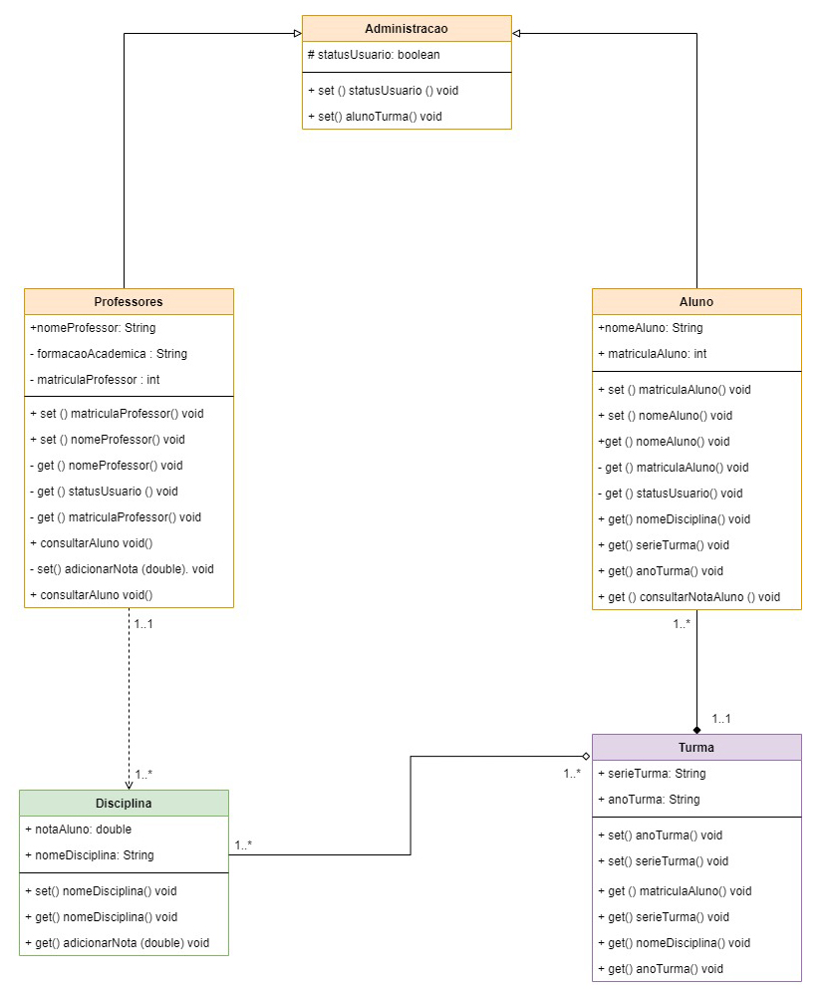

<h1 align="center">Digital House- Módulo II</h1>
<h3 align="center">Checkpoint1 - Programação Orientada a Objetos</h2>

&emsp; O objetivo deste checkpoint é utilizar conceitos de orientação a objetos
apresentados até o momento. Nesta primeira parte você deve enviar uma
proposta descrevendo o cenário de aplicação, seu diagrama de classes e a sua
implementação em Java. O checkpoint pode ser realizado em dupla ou
individual.

---

<h3 align="center"><u>Características básicas do problema e solução aplicada.</h3>

Uma escola de ensino fundamental possui 12 turmas e tem grande problema para emitir relatórios de aprovação e gerenciamento de alunos.
A escola pretende informatizar os registros referentes as Turmas,
 Professores e Alunos adotando um sistema que permita que o:

Administrador - Oque o usuário pode fazer ?

<ul>

<li>Pode gerir o estado de cada usuário para Ativo ou não ativo na instituição.</li>
<li>Inteiração com a Classe Turmas: Criar/Editar/Visualizar. Turmas e matérias atrelados a eles e os horários de cada Turma. </li>
<li>Inteiração com a Classe Alunos: Criar/Editar/Visualizar. Alunos e Gerencie Alunos entre turmas e informações relativas a sua inscrição.</li>
<li>Inteiração com a Classe Professores: Criar/Editar/Visualizar. Professores e seus horários.</li>
 
 </ul>

Professores - Oque o usuário pode fazer ?

 <ul>
<li>Inteiração com a Classe Aluno : Adicionar/ Editar Nota de um aluno - Visualizar dados relativos a inscrição do aluno
<li>Inteiração com a Classe Professor: Visualizar seus dados/matérias </li>
  </ul>

Alunos - Oque o usuário pode fazer ?

<li>Inteiração com a Aluno: Visualizar. Consulta sua nota, horários de aula , turmas que já participou ou participou, notas relativas a matéria, e dados relativos a sua inscrição ( nome,  ano letivo, turma que já participou e notas relativa à matéria)</li>

<h3 align="center">Este é o diagrama UML ilustrando todas interações de classes para o cenário apresentado acima </h3>

#### Equipe:

 - 
<a href="https://github.com/fehbr800" title="Matheus Emanuel Github">Matheus Emanuel</a>

 - 
<a href="https://github.com/vitinop" title="Victor Luz Github">Victor Luz</a>

